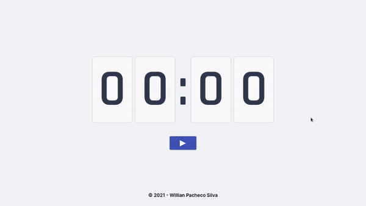

    
     

     
    
     

 
 

# WPS timer

 

Timer used for the Pomodoro method of time management. It has several preset times and gives an audible alert and a notification when the time is up.

     
    
    
    
    
    

